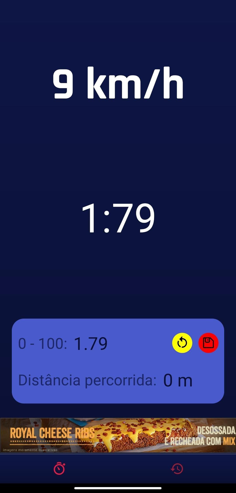
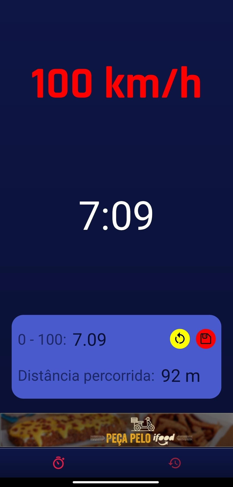
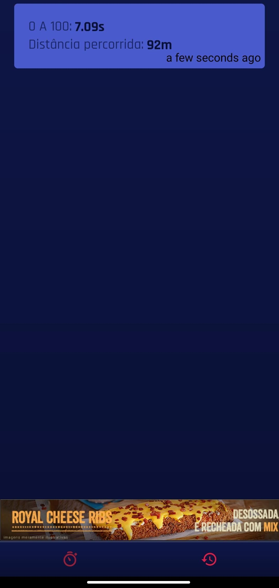

<h1 align="center">
   Velox
</h1>

<h3 align="center">
    A react native app that use the phone gps to calculate the seconds that a vehicle reach 100 km/h.
</h3>

<p align="center">
  

  
  
  <a href="https://github.com/ricknois/0a100/commits/master">
    
  </a>
    
  <a href="https://ricknois.github.io/">
    
  </a>
  
<h4 align="center"> 
	 Status: Finished
</h4>

<p align="center">
 <a href="#about">About</a> •
 <a href="#features">Features</a> •
 <a href="#layout">Layout</a> • 
 <a href="#tech-stack">Tech Stack</a> • 
 <a href="#author">Author</a> • 

</p>


## About


Velox is an application intended for the Brazilian public that calculate the seconds that a vehicle need to reach reach 100 km/h. 
It was developed to improve my react native skills.

---
## Download

[Google Play] (https://encurtador.com.br/nCKN4),

---
## Features

- [x] Users have access to the mobile application, where they can:
   - [x] start the counter
   - [x] see the result in seconds after reaching 100 km / h

---

## Layout

<p align="center">
  
  
  

  
  
</p>

---

### Pre-requisites

Before you begin, you will need to have the following tools installed on your machine:
[Git] (https://git-scm.com),
[Yarn] (https://yarnpkg.com/),
[Expo] (https://docs.expo.io/),
In addition, it is good to have an editor to work with the code like [VSCode] (https://code.visualstudio.com/)

#### Running the app (Mobile)

```bash

# Clone this repository
$ git clone git@github.com:ricknois/Velox.git

# Access the project folder in your terminal
$ cd Velox

# Install the dependencies
$ yarn install

# Run the application in development mode
$ expo start

# Scan the qr code in your expo mobile app

```

---

## Tech Stack

The following tools were used in the construction of the project:

**Mobile**  ([React Native](http://www.reactnative.com/)  +  [Java Script](https://www.javascript.com/))

-   **[Expo](https://expo.io/)**
-   **[React Navigation](https://reactnavigation.org/)**
-   **[Styled Components](https://styled-components.com/)**

---

## Author

 <sub><b>Rick Sousa</b></sub>
 <br />

Made with love by Rick Sousa 👋🏽 [Get in Touch!](https://www.linkedin.com/in/ricknois/)

---
